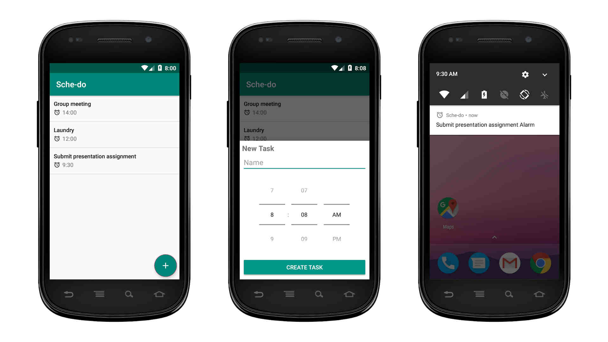

# Sche-do
A to-do android application enhanced with alarm feature and data persistence

## Screenshot

## Built With
* Kotlin
* Broadcast Receiver
* ACTION_BOOT_COMPLETED intent
* Services
* Alarm Manger
* Sugar ORM

## Features
* Create and persist tasks
* View all tasks
* Swipe to delete
* Background alarm notification
* Alarm persists after reboot
